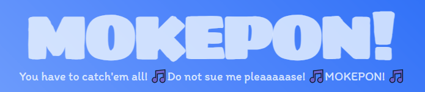

Una página web en la que juegas a un videojuego multijugador local similar al piedra, papel o tijeras, pero con mascotas elementales.

Para poder jugar, necesitas una computadora que actúe como servidor local al cual los jugadores se puedan conectar desde el navegador de sus dispositivos (chrome, firefox, edge, etc).

Para esto usaremos una herramienta llamada **Node.js**. Si nunca la instalaste, a continuación te muestro cómo hacerlo.

## How to install Node.js

Primero que nada descargaremos la herramienta desde su [página web oficial](https://nodejs.org/en) haciendo clic en la versión **LTS**, ya que es la versión más estable. Esto descargará un instalador a su computadora.

Una vez descargado ejecutamos el instalador, le damos a siguiente varias veces y luego a instalar. Las opciones de instalación que vienen por defecto están bien, aunque siempre puedes cambiar la que te parezca oportuna. La única que **NO** debes cambiar es una opción de instalación llamada **Add to PATH**, ya que nos facilitará iniciar el servidor.

Una vez instalado, descarga el repositorio haciendo click en **Code > Download ZIP**. Extrae la carpeta donde quieras.

## Launch the server

Para iniciar el servidor deberemos abrir la consola de comandos escribiendo en la barra de búsqueda "Simbolo del sistema" (**Windows**), "Terminal" (**Mac**) o desde el menú de aplicaciones (**Mac**/**Linux**).

Una vez abierta, realizamos lo siguiente:

### Windows

-  Si guardaste la carpeta en otra unidad diferente a C: (reemplaza **D:** por tu unidad)
    - D:
- Nos movemos al directorio de la carpeta que extragimos
    - cd "D:\path\to\dir"
- Iniciamos el servidor
    - node index.js

### Mac/Linux

- Nos movemos al directorio raíz
    - cd~
- Nos movemos al directorio de la carpeta que extragimos
    - cd /path/to/dir
- Iniciamos el servidor
    - node index.js

Espera un momento a que se inicie el servidor. Cuando ya esté funcionando, te aparecerá el mensaje **Server working!** en la consola.

LISTO! Ahora puedes jugar al juego escribiendo la dirección IP del servidor en la barra de búsqueda de cualquier navegador + el puerto 8080. Ejemplo: **192.168.1.3:8080**

Para saber la dirección IP, escribe y ejecuta la siguiente línea en tu terminal o consola de comandos:
- ipconfig (**Win**)
    - Busca la que dice "Dirección IPv4..."
- ifconfig (**Linux**)
    - La dirección está luego de "inet"
- Si estás en **Mac**
    - ipconfig getifaddr en0 (**WiFi**)
    - ipconfig getifaddr en1 (**Ethernet**)

*This project is an extended version that came from a web course. The same can be found [here](https://platzi.com/cursos/programacion-basica/).*

## Sounds used

PeriTune

- [Battle Music](https://soundcloud.com/sei_peridot/8bitrpg-battle) - [License](https://creativecommons.org/licenses/by/3.0/)

Pixabay

- [Map Music](https://pixabay.com/es/sound-effects/8bittownthemesong-59266/)
- [Game UI](https://pixabay.com/es/sound-effects/game-ui-sounds-14857/)
- [Game Start](https://pixabay.com/es/sound-effects/game-start-6104/)
- [Battle Win](https://pixabay.com/es/sound-effects/winsquare-6993/)
- [Battle Lose](https://pixabay.com/es/sound-effects/failure-1-89170/)